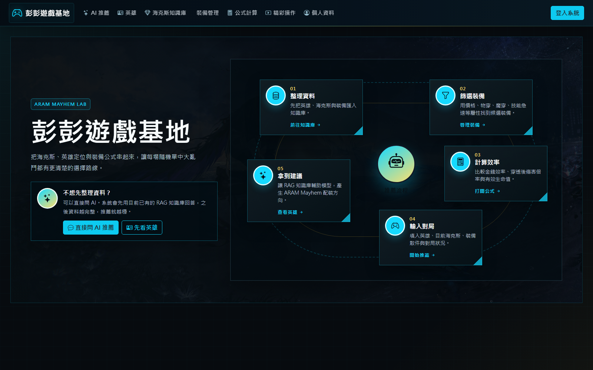
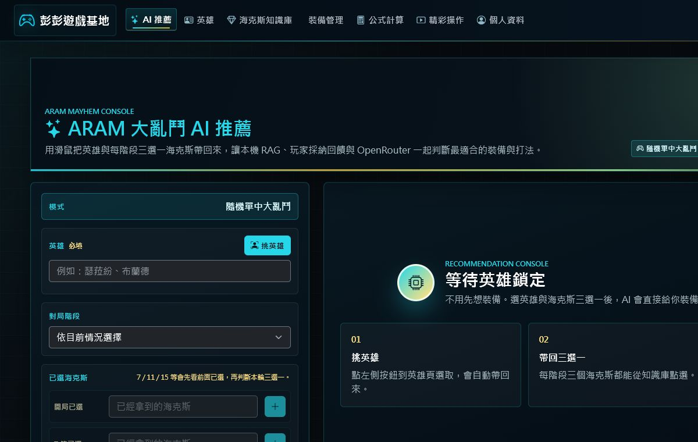
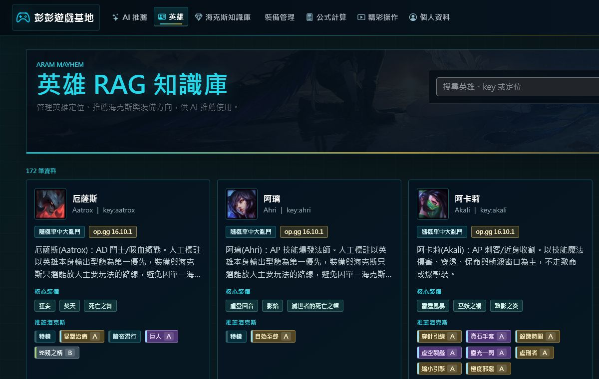
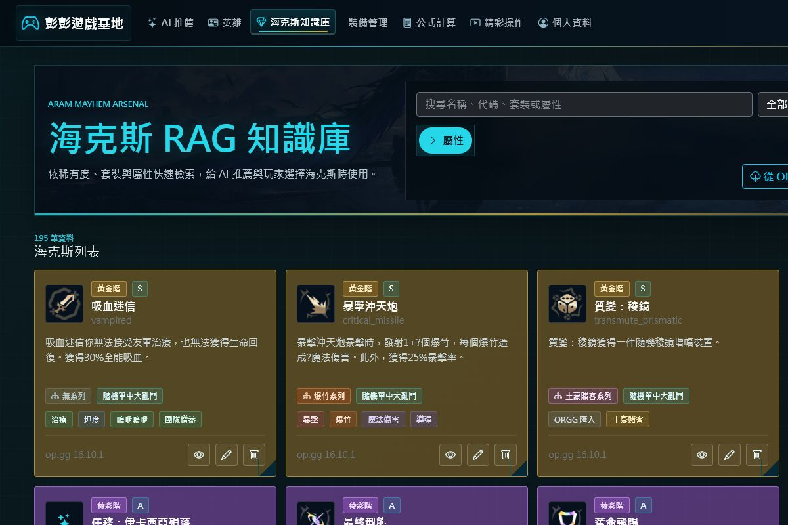
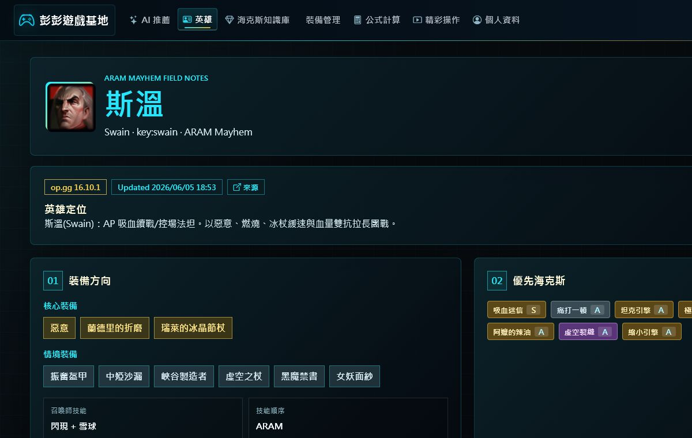
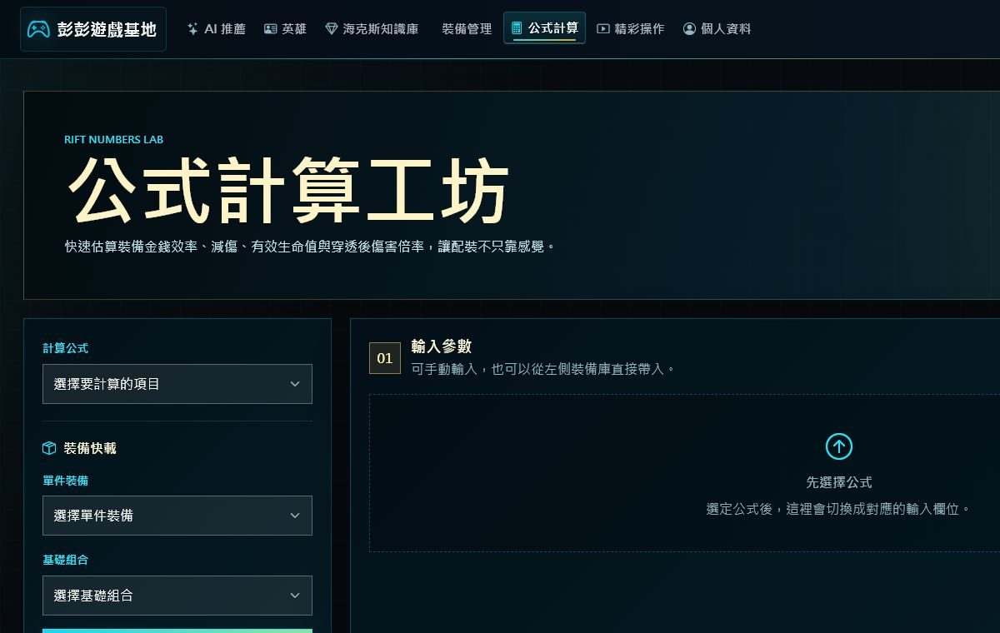
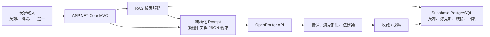

# 彭彭遊戲基地

### 結合檢索增強生成、玩家回饋與裝備公式的《英雄聯盟》隨機單中大亂鬥 AI 推薦系統

[線上展示](https://proposal-aram-assistant.onrender.com/) ·
[部署與資安設計](DEPLOYMENT_SECURITY.md) ·
[Supabase 遷移說明](database/supabase/README.md)

這是一個以 ASP.NET Core MVC 開發的全端 Side Project。系統把英雄定位、海克斯效果、套裝關係、裝備屬性與玩家採納紀錄整理成知識庫，再透過檢索增強生成（Retrieval-Augmented Generation, RAG）為 OpenRouter 模型提供當前對局資料。

它不是單純把問題轉送給 LLM。推薦前會先取得本機 RAG 知識、比對英雄與海克斯關係，並參考玩家收藏或採納過的結果；推薦後則以繁體中文、結構化區塊呈現裝備、海克斯與打法方向。



## 專案成果

| 項目 | 完成內容 |
| --- | --- |
| 遊戲資料 | 172 位英雄、195 個海克斯、189 件裝備 |
| AI 推薦 | 英雄選擇、分階段海克斯三選一、對局備註與裝備建議 |
| RAG 知識庫 | 英雄定位、人工標註、海克斯稀有度、套裝與屬性標籤 |
| 玩家回饋 | 收藏、採納與近期紀錄，供相似情境檢索 |
| 資料庫 | SQL Server 遷移至 Supabase PostgreSQL，12 張資料表啟用 RLS |
| 雲端部署 | Docker + Render + Supabase，具健康檢查與部署驗證腳本 |

## 核心體驗

### 依照實際對局流程輸入

玩家可以用滑鼠挑選英雄，並在開局、7 等、11 等、15 等分別帶回當輪三選一海克斯。後續階段會連同先前已選海克斯一起判斷，不需要重複輸入裝備。



### 將遊戲資料轉成可檢索知識

英雄資料不只記錄名稱與頭像，也包含定位、核心裝備、情境裝備、海克斯評級與人工打法筆記。海克斯則依稀有度、套裝系列及戰鬥屬性分類，讓玩家與推薦服務使用同一份資料來源。

<table>
  <tr>
    <td width="50%"></td>
    <td width="50%"></td>
  </tr>
  <tr>
    <td align="center"><strong>英雄 RAG 知識庫</strong></td>
    <td align="center"><strong>海克斯 RAG 知識庫</strong></td>
  </tr>
</table>

### 保留可解釋的推薦依據

每位英雄的詳情頁會整理角色定位、核心與情境裝備、推薦海克斯及打法資訊。這些欄位同時也是 RAG 檢索內容，讓 AI 不必只依賴模型自身記憶。



### 用公式輔助裝備決策

除了 AI 回答，網站也提供金錢效率、減傷、有效生命值及穿透後傷害倍率等計算工具，讓推薦結果可以回到數值層面檢查。



## 系統如何運作



玩家回饋不會訓練或修改第三方模型權重。系統會把採納紀錄存入資料庫，下一次遇到相似英雄與海克斯情境時，將可信的歷史結果加入檢索上下文。

## 工程設計

### 可替換的資料存取層

Controller 依賴 Repository 與 Service 介面，不直接綁定特定資料庫。透過 `Database__Provider` 可以在 SQL Server 與 Supabase PostgreSQL 之間切換，也讓資料搬移與雲端部署不必重寫整個 MVC 流程。

### 穩定的 AI 輸出

- 將英雄、已選海克斯、當輪三選一與對局狀況組成結構化提示。
- 限制模型以繁體中文與固定欄位回答。
- 對模型輸出進行 JSON 解析與容錯，避免格式不完整直接破壞頁面。
- 使用資料庫快取降低重複請求與 API 成本。
- 將玩家採納結果加入後續檢索，而不是宣稱能直接訓練外部模型。

### 資料治理

- 英雄、海克斯與裝備資料分開建模，避免把所有文字塞進單一欄位。
- 海克斯支援白銀、黃金、稜彩、套裝系列及屬性標籤。
- 管理員負責匯入與資料管理，一般使用者只使用查詢、推薦與收藏功能。
- 外部資料只作為整理依據，人工標註保留來源、版本與更新時間。

### 部署與資安

- API Key、資料庫密碼與管理員名單只由伺服器端環境變數讀取。
- Cookie 使用 `HttpOnly`、`SameSite=Lax`，正式環境要求 HTTPS。
- 寫入操作使用 antiforgery token，管理功能以角色授權限制。
- Supabase 資料表啟用列級安全性（Row Level Security, RLS）。
- 資料遷移預設為 dry run，套用前需要明確確認 staging 環境。
- 健康端點分為 `/healthz` 與含資料庫檢查的 `/readyz`。
- 部署閘門包含 secret scan、schema contract、local smoke 與 cloud preview smoke。

## 技術棧

| 分層 | 技術 |
| --- | --- |
| 後端 | C#、ASP.NET Core MVC、.NET 10 |
| 前端 | Razor Views、Bootstrap 5、Bootstrap Icons、客製 CSS |
| AI | OpenRouter Chat Completions、RAG、Prompt Engineering |
| 資料庫 | Supabase PostgreSQL、SQL Server、Npgsql |
| 資料處理 | Data Dragon、ClosedXML、管理員匯入工具 |
| 部署 | Docker、Render Blueprint、Supabase |
| 驗證 | PowerShell readiness checks、HTTP smoke tests、schema contract tests |

## 專案結構

```text
Proposal/
├─ Proposal/                  ASP.NET Core MVC 應用程式
│  ├─ Controllers/           頁面流程、授權與輸入處理
│  ├─ Models/                英雄、海克斯、裝備與推薦模型
│  ├─ Services/              Repository、RAG、AI 與資料匯入服務
│  ├─ Views/                 Razor UI
│  └─ wwwroot/               CSS、JavaScript 與圖片資源
├─ database/supabase/        PostgreSQL schema 與種子資料
├─ Tools/                    遷移、資安、部署與 smoke test 工具
├─ Reports/                  不含密鑰的驗證證據
├─ Dockerfile
└─ render.yaml
```

## 本機執行

需求：

- .NET 10 SDK
- SQL Server 或 Supabase PostgreSQL
- OpenRouter API Key

```powershell
dotnet restore Proposal.slnx
dotnet build Proposal.slnx
powershell -ExecutionPolicy Bypass -File StartDevServer.ps1 -Port 5214
```

開啟 `http://localhost:5214`。

使用環境變數或 `dotnet user-secrets` 設定密鑰，不要把真實值寫入設定檔：

```text
Database__Provider=SqlServer 或 Supabase
ConnectionStrings__DefaultConnection=server_side_database_connection_string
OpenRouter__ApiKey=openrouter_api_key
APP_ADMIN_USERS=admin_account_list
```

## 驗證

```powershell
dotnet build Proposal.slnx
powershell -ExecutionPolicy Bypass -File Tools\CloudReadinessCheck.ps1
powershell -ExecutionPolicy Bypass -File Tools\RunLocalSmoke.ps1 -Port 5226
powershell -ExecutionPolicy Bypass -File Tools\SupabaseContractCheck.ps1
```

目前驗證紀錄：

- Supabase staging migration：`APPLY_PASS`
- Deployment completion audit：`READY`
- Render cloud smoke：通過
- Local smoke：通過
- 驗證報告不記錄連線字串或密鑰

## 我在這個專案中實作的能力

- 從既有 MVC 裝備管理系統演進成完整 AI 產品，而非重做一次展示頁。
- 設計可持續維護的 RAG 資料結構與人工標註流程。
- 處理 LLM JSON 不完整、請求逾時、快取與繁體中文正規化。
- 將 SQL Server 資料安全遷移至 Supabase PostgreSQL。
- 以 Repository abstraction 降低資料庫切換對 Controller 的影響。
- 建立 Docker、Render、健康檢查、RLS 與自動化部署驗證流程。

## 後續方向

- 以版本化資料更新流程取代部分人工匯入。
- 增加推薦採納率與英雄、海克斯組合的可觀測指標。
- 為 AI 推薦加入離線評測集，量化資料更新前後的準確度。
- 擴充裝備公式與情境比較，讓推薦理由更具數值證據。

本專案為個人學習與作品集用途，與 Riot Games、OP.GG 或其他資料來源網站無官方關係。
